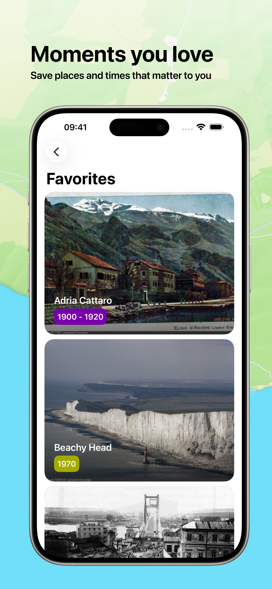

# Rewind

Rewind is an iOS app for exploring retro images on a map. Available in TestFlight: https://testflight.apple.com/join/vbJFFZgD. Hope it will be in the App Store soon.

### Features

- **Vintage images near you:** the app uses PastVu API to fetch images and their metadata and shows them on an Apple MapKit map
- **Favorites:** save images you like to view them later
- **Compare [[Work in progress](https://github.com/chizberg/Rewind/issues/12)]:** take a photo to compare how a place looks like today and how it looked in the past
- **Search:** quickly find places you know with a simple query. *Uses Apple MapKit search*

### Screenshots

  
  
  
  

### Availability
iOS 18+

### PastVu

All images in the app come from the [PastVu API](https://docs.pastvu.com/dev/api). You can see all these photos on [their website](https://pastvu.com). They have their rules, so better [check them out](https://docs.pastvu.com/en/rules) :)

### Stack

- SwiftUI
- Apple MapKit
- TCA-inspired Reducer
- [VGSL](https://github.com/yandex/vgsl)

#### P.S. Previous attempts

This is not the first time I try to make this app - you can find repos [PhotoPlenka](https://github.com/chizberg/PhotoPlenka) and [CameraRoll](https://github.com/chizberg/Camera-Roll). These have pretty much the same functionality, but in PhotoPlenka the UX feels off, and in CameraRoll there are performance issues. Still, could be fun to check them out!